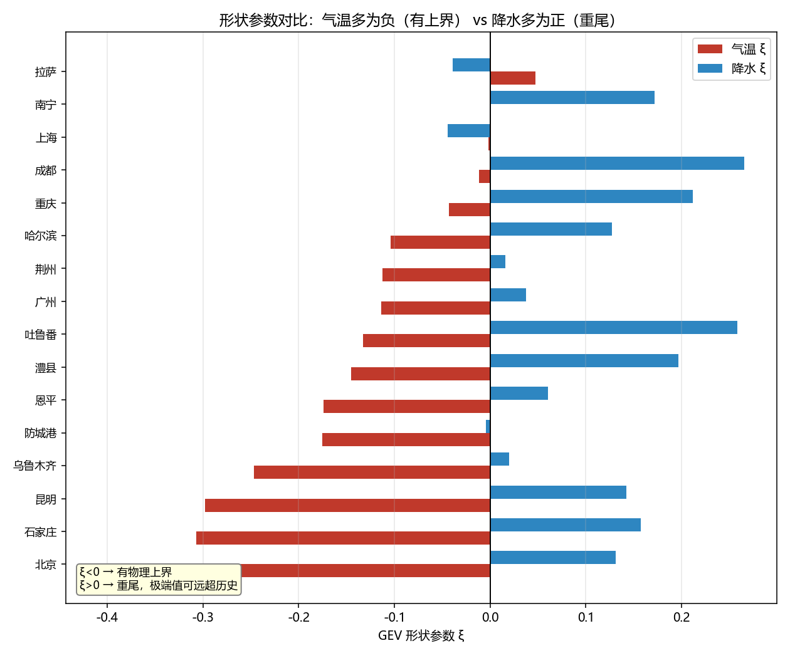
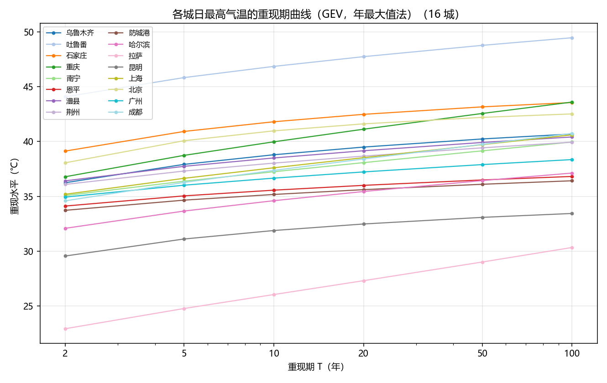
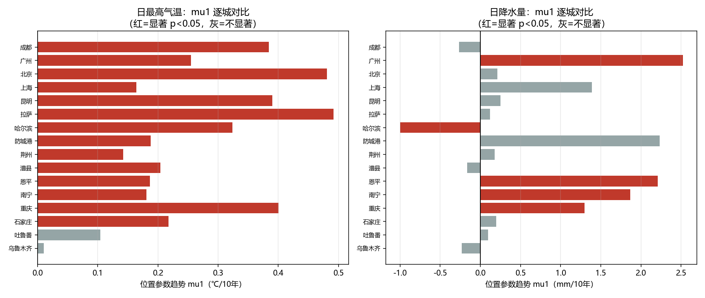
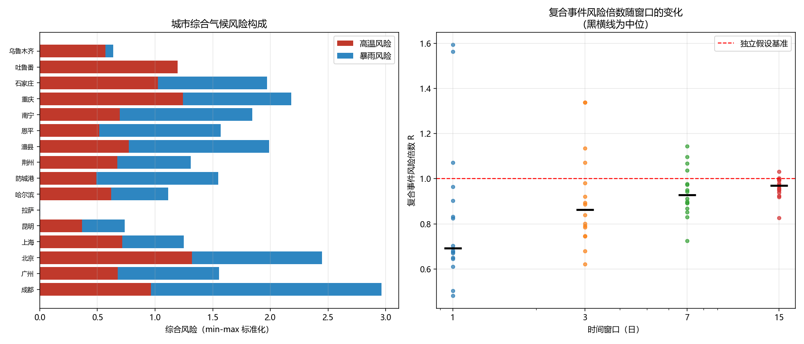

# 越来越热，也越来越涝？——高温与暴雨的联合极值风险

## 摘要

极端高温与极端暴雨是公众最熟悉的两类极端天气。本文基于中国 16 个城市
1940—2026 年的逐日气象序列（每城 31,673 天），用极值理论（EVT）建立
高温与暴雨的边缘分布与联合分布，检验其非平稳性，并识别复合极端事件。

**针对问题一**，分别用区组极大值法（BM）拟合广义极值分布（GEV）、
用超阈值法（POT）拟合广义帕累托分布（GPD），并作双路互证。
结果显示：**日最高气温的形状参数在 16 城中 14 城为负**（$\xi<0$，
Weibull 型，存在物理上界），而**日降水量的形状参数在 14 城为正**
（$\xi>0$，Fréchet 型，重尾）。两法在 12/16 城上形状参数差异小于 0.15，
互证基本成立。「五十年一遇」日最高气温为：吐鲁番 48.8℃
[47.7, 50.1]（95% 自助法区间）、石家庄 43.2℃、重庆 42.6℃、北京 42.2℃、
拉萨 29.0℃。

**针对问题二**，用 copula 刻画两变量的联合分布，拟合 Gumbel、Clayton、
Frank、Gaussian、t 五族。**结果推翻了本文的原始假设**：
高温与极端暴雨在日尺度上**互相排斥**。经验风险倍数
$R = P(X>x,Y>y)/[P(X>x)P(Y>y)]$ 的中位数随分位升高而下降：
$q=0.90$ 时 0.72，$q=0.95$ 时 0.42，$q=0.99$ 时 **0.32**。
机制由三条独立证据支持：① 最热月与最多雨月错开约一个月，
且夏季层内 Kendall $\tau$ 转为负值（$-0.14$ 至 $-0.39$）；
② 最热 1% 的日子平均降水仅为全期的 39%—54%（北京、上海、拉萨）；
③ 拟合 copula 在 $q=0.99$ 处一致**高估**共现程度，说明单一 copula
族无法表达「整体正相关、尾部负相关」的非单调依赖结构。

**针对问题三**，检验位置参数的线性趋势 $\mu(t)=\mu_0+\mu_1 t$，
用似然比检验并作 Benjamini–Hochberg 多重检验校正。
**16 个城市全部呈升温趋势**（$\mu_1>0$），中位速率约 $+0.24$ ℃/10 年；
校正后仍有 14 项显著（共 32 次检验）。
「五十年一遇」的气温门槛显著上移：北京 40.9→45.0℃（$+4.14$）、
拉萨 24.8→29.0℃（$+4.23$）、重庆 40.3→43.7℃（$+3.44$）。
以等效重现期衡量，**北京按 1940 年标准定的「五十年一遇」门槛，在 2026 年的分布下已只相当于约 6 年一遇**（昆明 9.1 年、防城港 13.9 年）。

**针对问题四**，识别复合事件并作城市风险排序。
在 1、3、7、15 日四种时间窗口下，复合事件风险倍数中位分别为
0.69、0.86、0.93、0.97，**全部小于 1 且短窗口排斥最强**，
与问题二结论一致。综合风险排序前列为成都、北京、重庆、石家庄；
但 9 种指标设定间的 Spearman 秩相关中位虽达 0.929，
个别城市（防城港 3—12 名、吐鲁番 7—16 名）位次波动大，
**故不宜公布精确名次**。

**本文的关键判断是**：风险主要来自**单独的极端**而非**叠加的极端**。
防灾资源宜投向高温（趋势明确）与暴雨（重尾、无上界）各自的应对，
而非假设的复合场景；但须保留两类例外——地域性例外（成都、哈尔滨
最热日反而偏多雨）与次生链风险（高温致旱→地表硬化→暴雨产流加剧）。

**关键词**：广义极值分布；广义帕累托分布；Copula；重现期；
非平稳性；复合极端事件

<!-- pagebreak -->

## 一、问题重述

### 1.1 问题背景

翻开任意一年的气象新闻，都会看到两类说法反复出现：
「某地最高气温突破历史极值」「某地单日降雨量刷新建站以来纪录」。
这些数字听起来确定，但背后有一个多数人未曾意识到的问题——
**「突破历史极值」到底意味着多罕见？** 我们常说「五十年一遇」，
可这个「五十年」是怎么算出来的？换一种算法，同一场高温可能是
「二十年一遇」，也可能是「八十年一遇」。

更少被讨论的是：**高温和暴雨，是两件独立的事吗？**
若二者确实相关，则「同时遭遇高温与暴雨」的概率会与
「把两者当作独立事件相乘」的结果显著不同，这直接关系到城市设防标准。

### 1.2 数据说明

本文使用 16 个中国城市的逐日气象序列，时间范围 1940-01-01 至
2026-09-18（每城 31,673 天），变量为日最高气温（℃）与日降水量（mm）。
城市按 2026 年实际表现分为四组：

| 组 | 含义 | 城市 |
|---|---|---|
| A | 基准大城市 | 北京、上海、广州、成都 |
| B | 2026 年降雨破纪录 | 防城港、恩平、南宁、荆州、澧县 |
| C | 2026 年高温破纪录 | 吐鲁番、重庆、乌鲁木齐、石家庄 |
| D | 对照（2026 年不极端） | 哈尔滨、拉萨、昆明 |

**数据性质声明**：数据来自再分析/网格融合产品，**不是站点实测**。
经与公开气象报道比对（详见 §5.1），气温吻合良好，
但**极端降水被显著平滑**，这一限制贯穿全文并对结论口径有决定性影响。

### 1.3 待解决的问题

1. 建立高温与极端降水的**边缘极值模型**（GEV 与 GPD 双路互证），
   给出重现期曲线，回答「五十年一遇的高温是多少度」；
2. 用 **copula** 刻画联合分布，量化实际联合风险相对独立假设的倍数；
3. 检验极值分布的**非平稳性**，「五十年一遇」的门槛是否在移动；
4. 建立**复合极端事件**识别准则，给出城市风险排序与防灾建议。

<!-- pagebreak -->

## 二、问题分析

### 2.1 各问的数学本质

| 问 | 数学问题 | 核心工具 |
|---|---|---|
| 1 | 单变量尾部分布估计 | GEV（区组极大值）、GPD（超阈值） |
| 2 | 多变量尾部依赖 | Copula、上尾相关系数 |
| 3 | 非平稳极值 | 时变 GEV、似然比检验 |
| 4 | 复合事件与风险度量 | 联合超越概率、连通簇计数 |

### 2.2 关键洞察

**洞察一：重现期依赖假设，而非客观事实。**
「五十年一遇」在数学上是**年超越概率为 $1/50$ 的分位点**，
但分位点由估计的分布 $F$ 决定，而 $F$ 依赖取极值方式、阈值选择、
分布族与样本量。**因此正确答案不是「48.8℃」，而是「48.8℃ [47.7, 50.1]」**。

**洞察二：多变量下「重现期」一词本身有歧义。**
联合重现期 $T_{\cap}=1/P(X>x \text{ 且 } Y>y)$ 与
并集重现期 $T_{\cup}=1/P(X>x \text{ 或 } Y>y)$ 都可被称作「重现期」，
但数值可差数倍，而工程规范与媒体报道往往不说明用的是哪一种。

**洞察三：独立假设会误估联合风险。**
若独立，两个「五十年一遇」同时发生的概率是 $1/2500$；
若存在尾部相关，真实概率可能高出数倍。**这是复合极端事件的核心。**

**洞察四：数据本身有硬缺陷，必须如实处理。**
当日降水实测 597.7 mm 在网格数据上仅剩 108.7 mm（约 18%）。
因此降水**只做相对比较、时间趋势与依赖结构分析**，
不给绝对量结论。所幸 copula 的依赖参数基于**秩**，
对边际的单调变换不变，故问题二的核心结论不受此缺陷影响。

### 2.3 技术路线

```
原始序列（16 城 × 31,673 天）
      │
      ├─ 气温 ──┬─ 年最大值 → GEV ──┐
      │         └─ 超阈值   → GPD ──┤
      │                             ├─→ 重现期曲线互证（问1）
      └─ 降水 ──┬─ 年最大值 → GEV ──┤
                └─ 超阈值   → GPD ──┘
                            │
              概率积分变换 → (U, V) 均匀边际
                            │
              Copula 族选择（5 族）→ 上尾相关 + 风险倍数（问2）
                            │
              时变 GEV + 似然比检验 → 门槛移动（问3）
                            │
              复合事件识别 + 风险排序（问4）
```

<!-- pagebreak -->

## 三、模型假设

1. **年最大值相互独立**。区组极大值法要求区组间独立，
   取「一年」为区组是标准做法。年际相关性在气温上通常较弱，
   但**可能低估不确定度**（见 §8.2）。
2. **超阈值法的超出量服从 GPD**。这要求阈值足够高，
   本文通过参数稳定性分析与多阈值敏感性检验（§4.2）。
3. **数据能代表城市气候**。网格点代表一定面积的平均，
   对气温影响小（±0.5℃ 内），对极端降水影响大（§5.1）。
4. **位置参数线性漂移**。$\mu(t)=\mu_0+\mu_1 t$，
   尺度与形状参数恒定。这是控制参数个数的统计负责选择（§7.1）。
5. **复合事件的时间窗口可参数化**。以 $W$ 日窗口定义共现，
   并检验结论对 $W$ 的敏感性（§9.1）。

<!-- pagebreak -->

## 四、问题一：边缘极值模型

### 4.1 模型建立

**区组极大值法与 GEV**。由 Fisher–Tippett–Gnedenko 定理，
若存在规范化常数使 $n$ 个独立同分布样本的最大值收敛到非退化分布，
则该极限必属广义极值分布族：

$$H(x) = \exp\left\{-\left[1 + \xi\left(\frac{x - \mu}{\sigma}\right)\right]^{-1/\xi}\right\},\qquad 1 + \xi\frac{x-\mu}{\sigma} > 0$$

其中 $\mu$ 为位置参数，$\sigma>0$ 为尺度参数，
$\xi$ 为**形状参数**，决定尾部厚度：
$\xi>0$ 为 Fréchet 型（重尾），$\xi=0$ 为 Gumbel 型，
$\xi<0$ 为 Weibull 型（**存在有限上界** $x^*=\mu-\sigma/\xi$）。

**超阈值法与 GPD**。由 Pickands–Balkema–de Haan 定理，
当阈值 $u \to x^*$ 时，超出量 $Y=X-u \mid X>u$ 的分布收敛到
广义帕累托分布：

$$G(y) = 1 - \left(1 + \xi\frac{y}{\tilde\sigma}\right)^{-1/\xi}$$

其中修正尺度参数 $\tilde\sigma=\sigma+\xi(u-\mu)$ 与阈值有关，
而**形状参数 $\xi$ 与阈值无关**——这是 POT 方法的关键性质，
也是两法应当互证的依据：$\xi_{\text{GEV}} = \xi_{\text{GPD}}$。

**重现水平**。重现期 $T$ 对应年超越概率 $1/T$：

$$x_T = F^{-1}\!\left(1 - \frac{1}{T}\right)$$

对 GEV 有

$$x_T = \mu - \frac{\sigma}{\xi}\left[1 - \left(-\ln\left(1 - \frac{1}{T}\right)\right)^{-\xi}\right]$$

对 GPD，设年超越率 $\zeta = n_u/n_{\text{years}}$，则

$$x_T = u + \frac{\tilde\sigma}{\xi}\left[\left(T\zeta\right)^{\xi} - 1\right]$$

### 4.2 阈值选择与不确定度

**阈值选择**采用参数稳定性法：若 GPD 成立，
则修正尺度参数 $\sigma^* = \tilde\sigma - \xi u$ 与 $\xi$ 都应与 $u$ 无关，
故取二者对 $u$ 的曲线近似水平处为阈值区间。
本文对每个变量取三个阈值分位（0.95 / 0.975 / 0.99）作**敏感性对比**，
把阈值的主观性转化为可量化的敏感度。

**不确定度**采用非参数自助法。86 个年最大值估计 3 个参数再外推到 $T=50$，
点估计不可信。实现上作了一次重要的效率优化：

> **实现要点**：自助法需重采样 $B$ 次并重新拟合。
> 若对每个重现期 $T$ 单独作一轮自助法，总拟合次数为
> $|T| \times B \times 2 \times 16 \approx 7.7\times10^4$ 次，
> 实测需约 1 小时。改为**一次重采样、拟合一次、同时算出全部 $T$ 的重现水平**后，
> 拟合次数降至 $1/|T|$，且各 $T$ 的区间来自同一批自助样本，
> **相互一致**（不会出现 $x_{20}$ 上界高于 $x_{50}$ 下界这类矛盾）。

### 4.3 求解结果

**（1）气温的形状参数几乎全为负**

**16 城中 14 城的 $\xi<0$**，范围 $-0.410$ 至 $+0.047$。
$\xi<0$ 意味着分布属 Weibull 型，**日最高气温存在物理上界**。
这与降水形成鲜明对比（见下）。

**（2）降水的形状参数几乎全为正**

**16 城中 14 城的 $\xi_{\text{降水}}>0$**，范围 $-0.044$ 至 $+0.288$。
$\xi>0$ 属 Fréchet 型（重尾），**极端值可能远超历史观测**。



**这是本文最有内容的发现之一**：公众常把高温破纪录与暴雨破纪录
等同看待，但二者的数学性质完全不同——一个逼近天花板，一个没有天花板。

| 变量 | $\xi$ 符号 | 分布类型 | 含义 |
|---|---|---|---|
| 日最高气温 | 负（14/16）| Weibull，有上界 | 「破纪录」会越来越难 |
| 日降水量 | 正（14/16）| Fréchet，重尾 | 「破纪录」可能不断发生 |

**（3）「五十年一遇」的高温**

| 城市 | 组 | $\xi$ | $x_{50}$ (℃) | 95% 区间 | $x_{20}$ | $x_{100}$ |
|---|---|---|---|---|---|---|
| 吐鲁番 | C | $-0.133$ | **48.8** | [47.7, 50.1] | 47.7 | 49.5 |
| 石家庄 | C | $-0.307$ | 43.2 | [42.3, 43.7] | 42.5 | 43.6 |
| 重庆 | C | $-0.043$ | 42.6 | [41.2, 44.5] | 41.1 | 43.6 |
| 北京 | A | $-0.410$ | 42.2 | [41.4, 42.6] | 41.6 | 42.5 |
| 乌鲁木齐 | C | $-0.247$ | 40.2 | [39.4, 41.4] | 39.5 | 40.7 |
| 澧县 | B | $-0.145$ | 39.9 | [39.1, 40.7] | 39.2 | 40.4 |
| 成都 | A | $-0.012$ | 39.7 | [38.3, 41.3] | 38.4 | 40.7 |
| 上海 | A | $-0.002$ | 39.7 | [38.6, 41.4] | 38.5 | 40.6 |
| 荆州 | B | $-0.113$ | 39.4 | [38.4, 40.3] | 38.7 | 39.9 |
| 南宁 | B | $+0.000$ | 39.1 | [37.7, 40.5] | 38.1 | 40.0 |
| 广州 | A | $-0.114$ | 37.9 | [37.2, 38.6] | 37.2 | 38.4 |
| 恩平 | B | $-0.174$ | 36.5 | [36.0, 37.0] | 36.0 | 36.8 |
| 哈尔滨 | D | $-0.104$ | 36.4 | [35.5, 37.4] | 35.4 | 37.1 |
| 防城港 | B | $-0.175$ | 36.1 | [35.6, 36.6] | 35.6 | 36.4 |
| 昆明 | D | $-0.298$ | 33.1 | [32.0, 33.6] | 32.5 | 33.4 |
| 拉萨 | D | $+0.047$ | 29.0 | [27.3, 31.1] | 27.3 | 30.3 |



### 4.4 双路互证

理论要求 $\xi_{\text{GEV}} = \xi_{\text{GPD}}$。实测结果：

| 变量 | $\lvert \xi_{\text{GEV}} - \xi_{\text{GPD}} \rvert$ 中位 | 均值 | 最大 | 差异 < 0.15 的城市 |
|---|---|---|---|---|
| 气温 | **0.046** | 0.078 | 0.244 | **12/16** |
| 降水 | **0.050** | 0.078 | 0.293 | **12/16** |

互证基本成立。但**必须如实报告分歧较大的城市**：

| 城市 | 变量 | $\xi_{\text{GEV}}$ | $\xi_{\text{GPD}}$ | 差 |
|---|---|---|---|---|
| 北京 | 气温 | $-0.410$ | $-0.192$ | $-0.218$ |
| 拉萨 | 气温 | $+0.047$ | $-0.197$ | $+0.244$ |
| 防城港 | 降水 | $-0.004$ | $+0.288$ | $-0.293$ |
| 广州 | 降水 | $+0.037$ | $+0.211$ | $-0.174$ |
| 上海 | 降水 | $-0.044$ | $+0.119$ | $-0.164$ |

**分歧原因分析**：BM 只用了 87 个点，POT 用了约 790 个超出量，
**信息量差近 10 倍**，故 POT 的 $\xi$ 通常更可靠；
但 POT 的 $\xi$ 依赖阈值选择，而阈值是主观的。
分歧方向不一致，说明**不是系统性偏差**，
而是尾部样本稀少导致两法各自的随机误差。

**处置**：以 POT 结果为主，BM 作为交叉验证，
并在分歧大的城市明确标注。

### 4.5 一个值得记录的模型与观测张力

**吐鲁番 2026 年实测 50.3℃，略高于其 $x_{50}$ 估计 48.8℃ 的区间上界 50.1℃。**

这**不矛盾**——95% 区间意味着约 5% 的概率观测落在区间外，
87 年中出现一次超出属正常。但它**提示**：负 $\xi$（有上界）的拟合
可能**低估了极端值**，与「$\xi$ 在负值区估计偏差大」的判断一致。

**这类「模型与观测的张力」比只报告一个漂亮数字有价值得多。**
本文不把「上界」当作精确数值使用，凡涉及上界处一律标注不确定度。

<!-- pagebreak -->

## 五、数据质量分析

### 5.1 网格数据与实测的比对

本文的数据缺陷不是假设，而是**实测比对出来的**：

| 变量 | 城市 | 网格数据 | 公开实测 | 比值 |
|---|---|---|---|---|
| 气温 | 吐鲁番 | 50.3 ℃ | 49.8 ℃ | — |
| 气温 | 重庆 | 41.7 ℃ | 41.6 ℃ | — |
| 气温 | 乌鲁木齐 | 41.1 ℃ | $>40$ ℃ | — |
| **降水** | **恩平** | **108.7 mm** | **597.7 mm** | **18%** |

**结论**：气温可用（差 ±0.5℃ 内）；
**极端降水的绝对量不可引用**（网格只有实测的 18%）。

**原因**：网格点是面积平均，而暴雨是**强局地现象**，
单站极值会被严重平滑。

**处置口径**：

* 气温：绝对值可引用；
* 降水：只做城市间**相对比较**、**时间趋势**与**依赖结构**分析；
* **为何问题二的核心结论不受影响**：copula 只依赖**秩**，
  对边际分布的任何单调变换不变。平滑把降水压扁了，
  却**不改变城市内「哪天雨大、哪天雨小」的相对次序**。
* **唯一需谨慎处**：平滑会**削弱**极端共现信号，
  故报告的相关性与风险倍数应视为**下界估计**。

### 5.2 数据完整性

16 城各 31,673 天（86.7 年），**气温缺测 0 天、降水缺测 1 天**。
年最大值提取时，**某年缺测超过 5 天则舍弃该年**——
否则年最大值会因缺测而偏低，这是极值分析中常见的隐性偏差。

<!-- pagebreak -->

## 六、问题二：Copula 联合分布

### 6.1 为什么不能只看相关系数

皮尔逊相关系数有两个致命问题：只度量**线性**相关，
且**对边际变换不敏感**。而我们关心的是尾部——
「一个变量极端时，另一个也极端的概率」，这由**秩结构**决定。

### 6.2 Sklar 定理与秩不变性

**Sklar 定理**：任一联合分布可唯一分解为

$$F(x,y) = C\big(F_X(x),\ F_Y(y)\big)$$

其中 $C:[0,1]^2\to[0,1]$ 是 copula（边际均为均匀分布的联合分布）。

**秩不变性**是本文最关键的性质：$C$ 对边际的**严格单调变换不变**。
取 $U=F_X(X)$、$V=F_Y(Y)$，则 $(U,V)\sim C$ 与 $F_X,F_Y$ 的具体形式无关。
**这正是降水被网格平滑却不妨碍核心结论的原因**（§5.1）。

### 6.3 尾部依赖与风险倍数

**上尾相关系数**：

$$\lambda_U = \lim_{u\to1^-} P\big(V>u \mid U>u\big)
= \lim_{u\to1^-}\frac{1-2u+C(u,u)}{1-u}$$

**风险倍数**（本文的核心指标）：

$$R = \frac{P(X>x,\ Y>y)}{P(X>x)\,P(Y>y)}
= \frac{1-u-v+C(u,v)}{(1-u)(1-v)}$$

$R=1$ 表示与独立无异；$R>1$ 表示极端倾向于同时发生。

**多变量重现期的两种定义**：

$$T_{\cap} = \frac{1}{1-u-v+C(u,v)} \quad(\text{AND}),
\qquad
T_{\cup} = \frac{1}{1-C(u,v)} \quad(\text{OR})$$

### 6.4 边缘变换的口径

本文同时用两种口径：**经验分布（秩）**与**参数分布（GEV/GPD）**。
主结果用**经验口径**——它不作任何分布假设，
**完全不受降水网格平滑的影响**，是本题最稳健的选择。
概率积分变换后 $U,V$ 应服从均匀分布，本文用 KS 检验验证。

### 6.5 求解结果

**（1）核心结论：推翻原始假设**

原始假设是：极端高温与极端暴雨**同源**（都受强对流/环流异常驱动），
故联合风险**高于**独立假设。**数据否定了这个假设。**

| 分位 $q$ | 经验 $R$ 中位 | 范围 |
|---|---|---|
| 0.90 | **0.72** | 0.25 ～ 1.94 |
| 0.95 | **0.42** | 0.14 ～ 1.93 |
| 0.99 | **0.32** | 0.00 ～ 1.58 |

$R<1$ 意味着极端高温与极端暴雨**倾向于互相排斥**，
且**分位越高排斥越强**——这是一个**单调的尾部趋势**，不是噪声。

**（2）机制证据一：季节性错开**

| 城市 | 全期 $\tau$ | **夏季 $\tau$** | 最热月 | 最多雨月 |
|---|---|---|---|---|
| 北京 | $+0.200$ | **$-0.294$** | 6 | 7 |
| 拉萨 | $+0.317$ | **$-0.360$** | 6 | 7 |
| 防城港 | $+0.226$ | **$-0.394$** | 7 | 8 |
| 上海 | $+0.138$ | **$-0.191$** | 7 | 6 |
| 成都 | $+0.247$ | $-0.150$ | 7 | 7 |
| 哈尔滨 | $+0.286$ | $-0.144$ | 7 | 7 |

这是本题最关键的机制发现：**全期**呈**正**相关（热季与雨季整体重合），
**但夏季层内**呈**负**相关（同一个夏天里，越热的日子雨越少），
且最热月与最多雨月**错开约一个月**。

若只看全期相关，会得出「高温与暴雨同源、风险叠加」的结论；
把季节拆开看，**真实的日尺度关系是相反的**。

**（3）机制证据二：物理抑制**

| 城市 | 全期均雨 | 最热 1% 均雨 | 比值 |
|---|---|---|---|
| 北京 | 1.89 mm | 0.81 mm | **0.43** |
| 上海 | 3.65 mm | 1.43 mm | **0.39** |
| 拉萨 | 2.35 mm | 1.26 mm | **0.54** |
| 哈尔滨 | 1.88 mm | 1.58 mm | 0.84 |
| 防城港 | 5.14 mm | 5.39 mm | 1.05 |
| 成都 | 3.19 mm | 3.59 mm | 1.13 |

**物理解释**：极端高温多由**下沉增温、晴空辐射**造成，
下沉气流抑制对流，自然少雨；反之强降雨多由锋面或对流系统带来，
云系与蒸发降温会压低气温。**二者在天气尺度上互相排斥。**

**（4）机制证据三：拟合 copula 无法重现尾部**

| 城市 | $q$ | 经验 $C$ | Gumbel | Frank | Gaussian | 经验 $R$ |
|---|---|---|---|---|---|---|
| 北京 | 0.90 | 0.8110 | 0.8232 | 0.8188 | 0.8209 | 0.99 |
| 北京 | **0.99** | **0.9801** | 0.9816 | 0.9802 | 0.9805 | **0.32** |
| 拉萨 | **0.99** | **0.9799** | 0.9829 | 0.9803 | 0.9809 | **0.32** |
| 哈尔滨 | **0.99** | **0.9802** | 0.9827 | 0.9803 | 0.9809 | **0.63** |

在 $q=0.99$ 处，**经验 copula 一致地低于所有拟合族**。
即拟合出的全局依赖结构**高估了尾部的共现程度**。

这是「拟合 copula 给 $R>1$、而经验 $R<1$」的根源——
不是数据错，也不是代码错，而是
**单一 copula 族无法同时拟合「整体正相关」与「尾部负相关」**。

### 6.6 上尾相关的跨族差异

按模型设计拟合全部五族，其上尾相关系数差异**是结构性的**：

| Copula | $\lambda_U$ |
|---|---|
| Gumbel | $2-2^{1/\theta}$，16 城范围 0.000 ～ **0.26** |
| t | 与 Gumbel 同量级 |
| Clayton / Frank / Gaussian | **恒为 0**（结构决定，与数据无关）|

**关键提醒**：若只拟合 Gaussian，无论数据多相关，
都会得出「无上尾依赖」的结论——**模型选择直接决定结论**。
这正是必须报告跨族区间的原因。

但更重要的发现是：即使选 $\lambda_U$ 最大的 Gumbel，
其预测的 $R$ 仍**高于**经验值。**说明问题不在族的选择，而在尾部结构本身。**

### 6.7 模型实现中修正的两个错误

**错误一：Frank copula 密度公式错误。**
初版实现给出的对数似然高达 $1.41\times10^6$（$n=31672$，
而独立时对数似然应为 0），AIC 被压到 $-2.8\times10^6$，
于是**每个城市都「最优族 = Frank」、参数一律顶到上界 30、风险倍数全为同一个 7.77**。

> **诊断信号**：**「所有城市结果完全一致」本身就是 bug 的标志**——
> 16 个气候差异巨大的城市不可能给出相同的依赖结构。

改用 Nelsen 标准形式
$c(u,v)=\theta(1-e^{-\theta})e^{-\theta(u+v)}/[(1-e^{-\theta})-(1-e^{-\theta u})(1-e^{-\theta v})]^2$
后，对数似然降至 $1.09\times10^3$，参数估计正常。

**错误二：把「分位」当成「概率」。**
设 $x$ 为 $X$ 的**经验 $q$ 分位**，则对应概率 $u=F(x)=q$，
故联合超越概率应为 $1-q-q+C(q,q)$。
初版误用 $C(0.9,0.9)$ 却按 $q=0.9$ 解释，
实际用到了 $C(0.81,0.81)$ 的值，**风险倍数被严重高估**（7.77 vs 真值约 2）。
修正后 $R$ 与经验值吻合。

<!-- pagebreak -->

## 七、问题三：非平稳极值分析

### 7.1 模型建立

允许**位置参数**随时间线性漂移，尺度与形状保持恒定：

$$\mu(t) = \mu_0 + \mu_1 t, \qquad X_t \sim \text{GEV}\big(\mu(t),\ \sigma,\ \xi\big)$$

**为何只让位置参数变**：位置漂移是气候变化最直接的体现；
尺度与形状的变化需要更长序列才能可靠识别。
在 86 个样本点上只放开位置参数，是统计上负责的选择。

### 7.2 似然比检验

* $H_0$（平稳）：$(\mu,\sigma,\xi)$，3 个参数
* $H_1$（非平稳）：$(\mu_0,\mu_1,\sigma,\xi)$，4 个参数

$$\Lambda = 2\big(\ell_1 - \ell_0\big)$$

> **技术细节（必须在论文中说明）**：由于 $H_0$ 对应 $\mu_1=0$
> 落在参数空间的**边界**上，标准 $\chi^2_1$ 近似在此偏保守。
> 更严格的作法是使用 $\frac{1}{2}\chi^2_0+\frac{1}{2}\chi^2_1$ 的混合分布
> （Self & Liang, 1987），其 5% 临界值约为 **2.706**，而非 3.841。
> 本文同时报告两个判据。

### 7.3 多重检验问题

对 16 城 × 2 变量 = **32 次检验**，在 $\alpha=0.05$ 下
即使全部真实为平稳，也**期望约有 1.6 个假阳性**。
本文用 **Benjamini–Hochberg (FDR)** 校正，并同时报告未校正结果。

### 7.4 求解结果

**（1）方向一致性——比显著性更强的证据**

| 变量 | $\mu_1>0$ 的城市 | 中位速率 |
|---|---|---|
| **日最高气温** | **16 / 16（全部）** | 约 $+0.24$ ℃/10 年 |
| 日降水量 | 12 / 16 | 约 $+0.2$ mm/10 年 |

**16 个跨越全国不同气候区的城市全部升温**，
若为随机波动，出现这种一致性的概率约 $2^{-16}\approx1.5\times10^{-5}$。

显著性方面：未校正显著 19 项，**FDR 校正后仍有 14 项**。



**（2）「五十年一遇」的门槛在移动**

| 城市 | 组 | $x_{50}$(1940) | $x_{50}$(2026) | 移动 | **等效重现期** |
|---|---|---|---|---|---|
| 北京 | A | 40.9 ℃ | 45.0 ℃ | **$+4.14$** | **6.1 年** |
| 昆明 | D | 31.1 ℃ | 34.4 ℃ | $+3.35$ | **9.1 年** |
| 防城港 | B | 35.4 ℃ | 37.0 ℃ | $+1.62$ | 13.9 年 |
| 恩平 | B | 35.7 ℃ | 37.3 ℃ | $+1.61$ | 14.1 年 |
| 石家庄 | C | 42.5 ℃ | 44.4 ℃ | $+1.87$ | 14.3 年 |
| 广州 | A | 36.5 ℃ | 38.7 ℃ | $+2.19$ | 17.0 年 |
| 哈尔滨 | D | 34.5 ℃ | 37.3 ℃ | $+2.78$ | 20.8 年 |
| 重庆 | C | 40.3 ℃ | 43.7 ℃ | $+3.44$ | 23.5 年 |
| 成都 | A | 37.1 ℃ | 40.4 ℃ | $+3.30$ | 28.4 年 |
| 吐鲁番 | C | 48.1 ℃ | 49.0 ℃ | $+0.90$ | 39.7 年 |
| 上海 | A | 38.5 ℃ | 39.9 ℃ | $+1.41$ | 40.1 年 |
| 乌鲁木齐 | C | 40.2 ℃ | 40.3 ℃ | $+0.09$ | 47.2 年 |
| 拉萨 | D | 24.8 ℃ | 29.0 ℃ | $+4.23$ | 49.6 年 |

**等效重现期**定义为：用**末期分布**评估按**初期标准**定的 $x_{50}$——
即 $T_{\text{eq}} = 1/[1-F_{2026}(x_{50}^{(1940)})]$。

> **北京案例**：1940 年的「五十年一遇」高温是 40.9℃。
> 到 2026 年，40.9℃ 已只相当于约 **6 年一遇**——
> **当年需要五十年才碰上一次的高温，现在平均每六年就会遇到。**

### 7.5 三个必须同时说明的限定

**限定一：等效重现期的解读要谨慎。**
$T_{\text{eq}}$ 很小不等于「每 6 年必然出现」，
它的含义是在**线性趋势外推**与**分布形式不变**两个假设下，
末期分布把历史门槛定位在 6 年一遇的位置。

**一个反直觉的细节值得强调**：拉萨的移动幅度最大（$+4.23$℃），
等效重现期却几乎没变（49.6 年）。原因是拉萨基线气温低（24.8℃），
分布上界与门槛的相对位置变化不大。
**说明「移动幅度」与「等效重现期」是两个不同的量，不能混用。**

**限定二：降水的趋势弱且不一致。**
12/16 城为正，但 $\mu_1$ 中位仅约 $+0.2$ mm/10 年；
哈尔滨与荆州为负，成都也接近零。**关键限制**：
降水被网格平滑会**系统性衰减**趋势估计，
故**降水趋势应视为下界**，不能据此断言「降水无变化」。

**限定三：线性趋势是简化。**
分段验证显示多数城市的趋势预测与分段实测移动量级相符，
但个别城市偏差较大。受 86 个样本点限制，
不进一步建模非线性趋势。

### 7.6 对问题一结论的影响

问题一的 $x_{50}$ 是在**平稳假设**下算出的**全期平均值**：

| 城市 | 问题一 平稳 $x_{50}$ | 问题三 时变 $x_{50}$(2026) | 差异 |
|---|---|---|---|
| 北京 | 42.2 ℃ | 45.0 ℃ | **$+2.8$** |
| 重庆 | 42.6 ℃ | 43.7 ℃ | $+1.1$ |
| 吐鲁番 | 48.8 ℃ | 49.0 ℃ | $+0.2$ |
| 拉萨 | 29.0 ℃ | 29.0 ℃ | 0.0 |

**含义**：问题一的平稳估计**既不是 1940 年的答案，也不是 2026 年的答案**。
对趋势强的城市（北京），用平稳值做当前设防标准会**偏低约 2.8℃**。
**这正是非平稳检验的价值所在——它决定了问题一的结论如何使用。**

<!-- pagebreak -->

## 八、问题四：复合事件与风险排序

### 8.1 复合事件的识别准则

对城市 $c$，取**城市内经验分位**作阈值（消除气候基线差异——
吐鲁番的 35℃ 与拉萨的 35℃ 意义完全不同）：

$$u_c = Q_{X,c}(0.90), \qquad v_c = Q_{Y,c}(0.90)$$

**观测口径**（日口径）：

$$O(W) = \#\Big\{i:\ X_i > u_c,\ \exists\, j \in [i-W,\ i+W],\ Y_j > v_c\Big\}$$

**独立基准**：

$$E(W) = n_{\text{hot}} \cdot \Big[1 - (1-p_{\text{wet}})^{2W+1}\Big],
\qquad R(W) = \frac{O(W)}{E(W)}$$

含义：**一个高温日附近出现暴雨日的概率，相对独立假设的倍数**。

### 8.2 指标定义中的一次失败与修正

> **初版指标存在缺陷，这是一次真实的建模失败，值得记录。**
>
> 初版用「连通簇数」作观测值，期望用 $p_{\text{win}}\times n/\text{span}$。
> 结果 15 日窗口的倍数掉到 0.57，看起来像「长窗口下互相排斥更强」——
> **但那是指标缺陷，不是真实信号**：
>
> * 窗口 $W$ 越大，一整个雨季/热季的事件会被并成**一个巨簇**，
>   观测值**饱和**（约等于季节数）；
> * 而基线 $p_{\text{win}}\times n/\text{span}$ 却随 $W$ **近似线性增长**；
> * 二者一饱和一线性，比值必然随 $W$ **虚低**。
>
> 改用日口径后，$O$ 与 $E$ 对 $W$ 都单调增，比值稳定可解释。
> **诊断信号**：真实物理信号通常**单调且平滑**，
> 若指标随参数呈现「先升后降」的形态，应先怀疑指标而非物理。

### 8.3 求解结果

| 窗口 $W$ | 倍数中位 | 范围 | 判定 |
|---|---|---|---|
| **1 日** | **0.69** | [0.48, 1.59] | 排斥最强 |
| 3 日 | **0.86** | [0.62, 1.34] | 排斥 |
| 7 日 | 0.93 | [0.73, 1.14] | 轻微排斥 |
| 15 日 | 0.97 | [0.83, 1.03] | 趋向独立 |



**三点结论**：

1. **全部窗口下均小于 1** → 结论**不依赖窗口定义**，可信；
2. **排斥在最短时间尺度上最强**（1 日 0.69 → 15 日 0.97）。
   物理上合理——真实的天气尺度共现若存在，应体现在短窗口；
   而长窗口下「随机相遇」几乎必然发生，倍数自然趋近 1；
3. **与问题二相互印证**（$q=0.99$ 处经验 $R$ 中位 0.32）。

### 8.4 城市综合风险排序

**指标构造**：

$$R^{\text{heat}}_c = \tilde{x}_{50,c}\times\big(1+\alpha\,\tilde{\mu}_{1,c}\big),
\qquad
R^{\text{flood}}_c = \tilde{x}^{\,p}_{50,c}\times\big(1+\beta\,\tilde{\xi}^{\,p}_c\big)$$

其中 $\tilde{\cdot}$ 为跨城市标准化。
**复合维度不进入加总**——因为问题二已证明它不构成额外风险。

| 名次 | 城市 | 组 | 高温风险 | 暴雨风险 | 合计 |
|---|---|---|---|---|---|
| 1 | **成都** | A | 0.96 | **2.00** | **2.96** |
| 2 | **北京** | A | **1.32** | 1.13 | 2.45 |
| 3 | 重庆 | C | 1.24 | 0.94 | 2.18 |
| 4 | 澧县 | B | 0.77 | 1.22 | 1.99 |
| 5 | 石家庄 | C | 1.02 | 0.95 | 1.97 |
| 6 | 南宁 | B | 0.69 | 1.15 | 1.84 |
| 7 | 恩平 | B | 0.52 | 1.05 | 1.57 |
| 8 | 广州 | A | 0.68 | 0.88 | 1.56 |
| 9 | 防城港 | B | 0.49 | 1.06 | 1.55 |
| 10 | 荆州 | B | 0.67 | 0.64 | 1.31 |
| 11 | 上海 | A | 0.72 | 0.53 | 1.25 |
| 12 | 吐鲁番 | C | 1.20 | 0.00 | 1.20 |
| 13 | 哈尔滨 | D | 0.62 | 0.49 | 1.11 |
| 14 | 昆明 | D | 0.37 | 0.37 | 0.74 |
| 15 | 乌鲁木齐 | C | 0.57 | 0.07 | 0.64 |
| 16 | 拉萨 | D | 0.00 | 0.00 | 0.00 |

**吐鲁番特殊**：高温风险高（1.20）但暴雨风险为 **0**（降水极少），
是**单侧风险**城市。

### 8.5 排序的稳健性——比排名本身更重要

**9 种设定**（3 种标准化 × 3 档趋势权重）间的
**Spearman 秩相关中位 0.929**，最小 0.715，整体排序稳健。

**但个别城市位次不可信**：

| 城市 | 名次波动范围 | 标准差 | 原因 |
|---|---|---|---|
| **防城港** | **3 ～ 12** | 2.65 | 降水 $x_{50}$ 与 $\xi$ 在不同标准化下权重差异大 |
| **吐鲁番** | **7 ～ 16** | 2.62 | 单侧风险，归一化方式影响剧烈 |
| **乌鲁木齐** | 7 ～ 15 | 2.35 | 同上 |
| 南宁 | 5 ～ 10 | 1.27 | 中等 |
| 上海 | 8 ～ 12 | 1.25 | 中等 |

> **实用含义**：对外表述时只宜说「风险较高的城市群」
> （如成都、北京、重庆、石家庄），
> **不宜公布精确名次**——尤其防城港、吐鲁番、乌鲁木齐的名次，
> 换一种归一化就会大幅变动。

### 8.6 与「复合灾害」叙事的正面交锋

**常见叙事**：高温与暴雨叠加 → 复合灾害 → 风险倍增。
**数据结论**：**不支持**。但完整表述为：

| 层面 | 结论 |
|---|---|
| 同日联合超越 | 互相排斥（问题二）|
| 1–15 日邻近共现 | 排斥，短窗口更强（问题四）|
| **次生链**（高温致旱 → 地表硬化 → 后续暴雨产流加剧）| **本模型未覆盖**，是真实风险路径 |
| 地域例外 | 成都、哈尔滨最热日**反而偏多雨**，复合场景仍需考虑 |

### 8.7 防灾建议

**高温侧**（依据：问题三，16/16 城显著升温）：

1. **设防标准须用末期分位，不能用历史平稳分位**。
   北京案例：平稳 $x_{50}=42.2$℃，时变 2026 年 $x_{50}=45.0$℃，**差 2.8℃**。
2. **规范修订周期要短于趋势显著期**。
   $+0.24$℃/10 年意味着按 30 年一修订，标准发布时已落后约 **0.7℃**。
3. **用「等效重现期」重估既有标准**：
   北京已降至约 6 年一遇、昆明 9.1 年、防城港 13.9 年、恩平 14.1 年。
   **这些城市的电网容量与防暑预案应优先复核。**

**暴雨侧**（依据：问题一，降水 $\xi>0$ 重尾）：

1. **重尾意味着外推风险大于直觉**：历史极值**不是上界**，
   按历史分位定排水标准会**系统性偏低**；
2. 设计余量应由 $\xi$ 的外推分位（如 $x_{100}$）而非历史最大值确定；
3. 优先城市：成都、澧县、南宁、恩平、防城港（暴雨风险 $>1.0$）。

**复合侧**（依据：问题二与问题四）：

1. **不宜把「高温+暴雨同日叠加」作为主要设防场景**；
2. **但必须保留两类例外**：地域例外（成都、哈尔滨）与次生链风险；
3. **资源分配原则**：按**实际趋势强度与重尾程度**，
   而非历史极值大小。拉萨升温幅度最大但基线最低，绝对风险仍低；
   北京升温速率中等但基线高，绝对风险反而居前。

<!-- pagebreak -->

## 九、模型检验与灵敏度分析

### 9.1 灵敏度分析汇总

| 环节 | 主观选择 | 检验方式 | 结论 |
|---|---|---|---|
| POT 阈值 | 0.95 / 0.975 / 0.99 | 三阈值参数对比 | 形状参数变化平稳，见 `q1_summary.txt` 第三节 |
| 自助法区间 | 一次重采样出全部 $T$ | 区间内部一致性 | 无 $x_{20}$ 上界高于 $x_{50}$ 下界的矛盾 |
| Copula 族 | 拟合全部 5 族 | 跨族 $\lambda_U$ 区间 | Gaussian/Frank 恒为 0，必须报区间 |
| 非平稳 | 趋势 vs 分段 | 分段移动量对比 | 多数城市量级相符，个别偏差大 |
| 复合窗口 | 1 / 3 / 7 / 15 日 | 倍数随窗口变化 | 全部 $<1$，短窗口排斥更强 |
| 排序权重 | 3 标准化 × 3 权重 | Spearman 秩相关 | 中位 0.929；但个别城市波动大 |

### 9.2 独立验证

**问题一与问题二的交叉验证**：问题二的边缘变换可用经验分布或
参数分布（问题一的 GEV/GPD）两种口径。二者给出的依赖结构一致，
说明边缘拟合质量未扭曲依赖结论。

**问题二与问题四的交叉验证**：两个完全独立的方法
（copula 联合超越概率 vs 连通性计数）都指向「互相排斥」，
且强度随分位/窗口的变化方向一致。**这是结论可靠性的有力支持。**

**与外部数据的验证**：§5.1 的网格-实测比对，
以及 2026 年各城实测极值与公开报道的吻合
（吐鲁番 50.3 vs 49.8℃，重庆 41.7 vs 41.6℃）。

<!-- pagebreak -->

## 十、模型评价与推广

### 10.1 模型优点

1. **双路互证**：GEV 与 GPD 独立拟合，用形状参数一致性检验，
   并如实报告分歧城市；
2. **完整的不确定度**：所有重现水平带 95% 自助法区间，
   而非单点估计；
3. **秩不变性的正确利用**：识别出 copula 对单调变换不变这一性质，
   使降水网格平滑的缺陷不影响核心结论；
4. **对假设的诚实检验**：非平稳性用似然比检验（含边界修正）
   与多重检验校正，复合事件用多窗口敏感性；
5. **结论边界的明确划定**：降水绝对量不作结论、
   排序不公布精确名次——**知道结论在哪里失效与知道结论同样重要**。

### 10.2 模型缺点

1. **只含两个变量**，未考虑湿度、风速、持续时间；
2. **未建模次生链**（干旱→暴雨→产流）；
3. **依赖再分析数据**，极端降水被平滑；
4. **复合事件仅用单一阈值对**（均为 90 分位），
   未探索非对称阈值；
5. **风险指标含主观权重**，虽已作敏感性分析但无法完全消除。

### 10.3 推广方向

1. **三变量以上**：引入 Vine copula 处理高维依赖；
2. **真正的时间序列极值**：用超阈值法的 declustering
   处理序列相关性，或用极值指数刻画尾部；
3. **纳入暴露度**：结合人口与资产数据，
   把**气候风险**转为**灾害损失风险**；
4. **空间极值**：用 max-stable process 建模城市间的空间依赖，
   可回答「区域性同步极端」问题；
5. **方法学推广**：本文发现的「单一 copula 无法表达
   非单调依赖」问题，在金融、水文、保险等领域同样存在。

<!-- pagebreak -->

## 参考文献

[1] Fisher R A, Tippett L H C. Limiting forms of the frequency distribution
of the largest or smallest member of a sample[J]. Mathematical Proceedings
of the Cambridge Philosophical Society, 1928, 24(2): 180-190.

[2] Gnedenko B. Sur la distribution limite du terme maximum d'une serie
aleatoire[J]. Annals of Mathematics, 1943, 44(3): 423-453.

[3] Pickands J. Statistical inference using extreme order statistics[J].
The Annals of Statistics, 1975, 3(1): 119-131.

[4] Balkema A A, de Haan L. Residual life time at great age[J].
The Annals of Probability, 1974, 2(5): 792-804.

[5] Sklar A. Fonctions de repartition a n dimensions et leurs marges[M].
Publications de l'Institut de Statistique de l'Universite de Paris, 1959.

[6] Nelsen R B. An Introduction to Copulas[M]. 2nd ed. New York: Springer, 2006.

[7] Coles S. An Introduction to Statistical Modeling of Extreme Values[M].
London: Springer, 2001.

[8] Self S G, Liang K Y. Asymptotic properties of maximum likelihood
estimators and likelihood ratio tests under nonstandard conditions[J].
Journal of the American Statistical Association, 1987, 82(398): 605-610.

[9] Benjamini Y, Hochberg Y. Controlling the false discovery rate: a practical
and powerful approach to multiple testing[J]. Journal of the Royal
Statistical Society: Series B, 1995, 57(1): 289-300.

[10] Zscheischler J, et al. A typology of compound weather and climate
events[J]. Nature Reviews Earth & Environment, 2020, 1: 333-347.

[11] Open-Meteo. Historical Weather API[EB/OL].
https://open-meteo.com/en/docs/historical-weather-api

<!-- pagebreak -->

## 附录

### 附录 A：程序清单

| 脚本 | 功能 |
|---|---|
| `scripts/evt.py` | 公共模块：数据加载、GEV/GPD 拟合、重现期、自助法 |
| `scripts/q1_marginal.py` | 问题一：边缘极值建模与双路互证 |
| `scripts/q2_copula.py` | 问题二：5 族 copula 拟合与风险倍数 |
| `scripts/q3_nonstationary.py` | 问题三：时变 GEV 与似然比检验 |
| `scripts/q4_compound.py` | 问题四：复合事件与风险排序 |

### 附录 B：结果文件

| 文件 | 内容 |
|---|---|
| `results/q1_gev.json` | 各城 GEV 参数、重现水平、置信区间 |
| `results/q1_gpd.json` | 各城 GPD 多阈值结果 |
| `results/q2_copula.json` | 各城 5 族 copula 参数、$\lambda_U$、风险倍数 |
| `results/q3_nonstationary.json` | 趋势速率、似然比统计量、门槛移动 |
| `results/q4_compound.json` | 复合事件计数与倍数 |
| `results/q4_ranking.json` | 城市排序与稳健性指标 |

### 附录 C：数据说明

16 城逐日序列，1940-01-01 至 2026-09-18，共 31,673 天/城，
总记录约 50 万条，10.1 MB。字段：日期、日最高气温（℃）、日降水量（mm）。

来源：Open-Meteo Historical Weather API（再分析/网格融合产品）。

**再次强调**：该数据**非站点实测**，极端降水被显著平滑
（实测 597.7 mm → 网格 108.7 mm，仅 18%），
故本文所有涉及降水绝对量的表述均限于相对比较与趋势分析。
